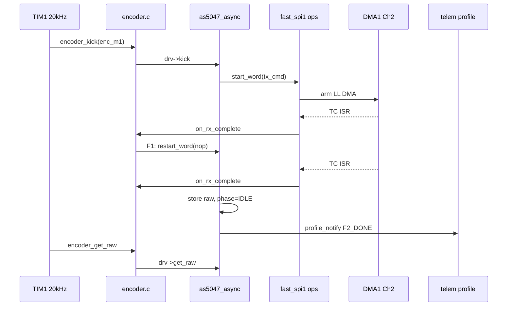

# SPI 编码器架构实现说明

> **状态：M1 编码器 v1.0 — 已冻结（2026-06）**  
> 本文描述 **当前仓库已落地** 的 SPI 磁编码器软件架构（AS5047 @ 20 kHz），供 bringup、FOC 集成与后续扩展（SPI3 / MT6816）参考。  
> **冻结范围**：`Drivers/encoder`、`Drivers/as5047`、`platform/encoder_spi_bus*`、`board/board_encoder_m1` 的 API 与 DMA 时序语义；后续 FOC 工作 **不应再改** 上述骨架，仅通过集成层调用。  
> **已知技术债务**见 [§14 故意遗留的技术债务](#14-故意遗留的技术债务以后再说)，FOC / 双路 / 多芯片阶段再还。

---

## 1. 设计目标

| 目标 | 实现方式 |
|------|----------|
| 20 kHz 电流环可读最新 raw | TIM1 `encoder_kick` + DMA 双帧读，`encoder_get_raw` 只读缓存 |
| 多实例（SPI1 + SPI3） | 每实例独立 `encoder_t` + `as5047_ctx_t` + `encoder_spi_bus_t` |
| 多芯片（AS5047 / MT6816） | `encoder_driver_t` 函数表，chip 层可替换 |
| 热路径性能 | M1 绑定 `encoder_spi_bus_ops_spi1_fast`（硬编码 LL，无 channel switch） |
| 遥测与核心解耦 | 可选 `encoder_profile_cb`，bringup 通过 `telem_encoder_profile_bind` 注册 |
| CubeMX 边界 | SPI 模式、DMA 通道在 Cube 配置；帧协议与状态机在 chip driver |

---

## 2. 分层架构

```text
┌─────────────────────────────────────────────────────────────────┐
│ L0 集成    Core/Src/main.c, stm32g4xx_it.c, app_freertos.c      │
├─────────────────────────────────────────────────────────────────┤
│ L1 统一 API Drivers/encoder/encoder.h, encoder.c                │
├─────────────────────────────────────────────────────────────────┤
│ L2 芯片    Drivers/as5047/                                      │
│            as5047_protocol.c  — 阻塞 HAL、parity、unwrap         │
│            as5047_async.c     — F1→F2 状态机，encoder_driver_t  │
├─────────────────────────────────────────────────────────────────┤
│ L3 SPI 总线 platform/encoder_spi_bus.h, encoder_spi_bus.c       │
│            encoder_spi_bus_fast_spi1.c   ← M1 生产路径           │
│            encoder_spi_bus_generic_g4.c  ← SPI3 / 未来实例       │
├─────────────────────────────────────────────────────────────────┤
│ L4 板级    board/board_encoder_m1.c, board_encoder.h            │
├─────────────────────────────────────────────────────────────────┤
│ L5 Cube/HAL spi.c, dma.c, gpio.c, tim.c（模式与通道，不改协议）   │
└─────────────────────────────────────────────────────────────────┘
```

**依赖方向（单向，禁止反向）：**

```text
main / board  →  encoder  →  as5047  →  encoder_spi_bus  →  HAL / LL
                              ↑
                    不 include 遥测头文件
遥测仅通过 encoder_set_profile_cb 反向注册
```

---

## 3. 目录与源文件

| 路径 | 职责 |
|------|------|
| `Drivers/encoder/encoder.h` | `encoder_t`、`encoder_driver_t`、统一 API、profile 事件 |
| `Drivers/encoder/encoder.c` | 薄封装，转发至 `drv->*` |
| `Drivers/as5047/as5047.h` | 寄存器定义、`AS5047_HandleTypeDef`、`as5047_ctx_t` |
| `Drivers/as5047/as5047_protocol.c` | parity、阻塞读、`as5047_unwrap`、兼容 API `AS5047_read` |
| `Drivers/as5047/as5047_async.c` | 异步 DMA 状态机，导出 `as5047_encoder_driver` |
| `platform/encoder_spi_bus.h` | `encoder_spi_bus_ops_t`、`encoder_spi_bus_t` |
| `platform/encoder_spi_bus.c` | ops 分发（cs / start / dma_isr 等） |
| `platform/encoder_spi_bus_fast_spi1.c` | SPI1 + DMA1 Ch2/Ch3 快速路径 |
| `platform/encoder_spi_bus_generic_g4.c` | 按 `dma_ll_rx_ch` switch 的通用 G4 路径 |
| `board/board_encoder_m1.c` | M1 实例绑定、bus 回调、DMA ISR 入口 |
| `Drivers/mt6816/mt6816.h` | 占位，尚未实现 |

**Keil 工程**（`MDK-ARM/STM32G474RET6_MOTOR.uvprojx`）已纳入上述源文件，Include 路径含：`Drivers/encoder`、`Drivers/as5047`、`platform`、`board`。

**已移除的旧实现：** `bringup/as5047.c`（单体 DMA）、`bringup/bsp_as5047_spi1_ll.*`。

---

## 4. 核心数据结构

### 4.1 `encoder_spi_bus_ops_t`（L3）

```c
typedef struct encoder_spi_bus_ops {
    void (*cs_low)(encoder_spi_bus_t *bus);
    void (*cs_high)(encoder_spi_bus_t *bus);
    void (*hw_init)(encoder_spi_bus_t *bus);
    void (*hw_stop)(encoder_spi_bus_t *bus);
    int  (*start_word)(encoder_spi_bus_t *bus, const uint16_t *tx, uint16_t *rx);
    int  (*restart_word)(encoder_spi_bus_t *bus, const uint16_t *tx, uint16_t *rx);
    void (*dma_isr)(encoder_spi_bus_t *bus);
} encoder_spi_bus_ops_t;
```

两套 ops 实例：

| 符号 | 用途 |
|------|------|
| `encoder_spi_bus_ops_spi1_fast` | M1：硬编码 `TC2/GI2/TE2`，无运行时 channel 分支 |
| `encoder_spi_bus_ops_generic_g4` | 通用：按 `bus->dma_ll_rx_ch` 选择 LL flag API |

### 4.2 `encoder_driver_t`（L2 → L1）

```c
typedef struct {
    int      (*init)(encoder_t *e);
    int      (*async_init)(encoder_t *e);
    void     (*kick)(encoder_t *e);
    uint16_t (*get_raw)(const encoder_t *e);
    void     (*on_rx_complete)(encoder_t *e);
    void     (*on_error)(encoder_t *e);
    float    (*unwrap)(encoder_t *e, uint16_t raw);
} encoder_driver_t;
```

AS5047 实现：`const encoder_driver_t as5047_encoder_driver`（`as5047_async.c`）。

### 4.3 板级实例（M1）

```c
encoder_spi_bus_t enc_m1_bus;
as5047_ctx_t      enc_m1_as5047;
encoder_t         enc_m1;
```

| 字段 | M1 取值 |
|------|---------|
| `enc_m1_bus.ops` | `&encoder_spi_bus_ops_spi1_fast` |
| `enc_m1_bus.spi` | `SPI1` |
| DMA RX / TX | `LL_DMA_CHANNEL_2` / `LL_DMA_CHANNEL_3` |
| CS | `GPIOA`, `GPIO_PIN_4` |
| `enc_m1_as5047.hal` | `&AS5047_spi1_PORT` |

---

## 5. 运行时数据流

### 5.1 启动顺序（`main.c`）

```text
Cube MX_Init
  → board_encoder_m1_init()          // M1：encoder 框架 + fast ops
  → AS5047_Init(&AS5047_spi3_PORT, …) // SPI3：仅阻塞 HAL，未进 DMA 框架
  → telem_bringup_init()
  → telem_encoder_profile_bind(&enc_m1)   // 可选，bringup 性能统计
  → TIM1 PWM + Base IT 20 kHz
  → osKernelStart
```

`board_encoder_m1_init()` 内部：

1. 填充 `enc_m1_bus`（ops、SPI、DMA 通道、CS、回调）
2. `AS5047_Init(&AS5047_spi1_PORT, &hspi1, GPIOA, PIN_4)`
3. `encoder_init(&enc_m1, &as5047_encoder_driver, &enc_m1_as5047, &enc_m1_bus)`
4. `encoder_async_init(&enc_m1)` — 阻塞读首帧 raw + `encoder_spi_bus_hw_init`

### 5.2 AS5047 双帧读时序

AS5047 读角寄存器需 **命令帧 + NOP 帧**（pipeline）：

```text
phase=IDLE
    │  TIM1: encoder_kick()
    ▼
FRAME1: CS↓ → start_word(tx_cmd) → DMA 1×16bit → TC → on_rx_complete
    │  CS↑ CS↓ → restart_word(tx_nop) → DMA
    ▼
FRAME2: TC → on_rx_complete → 存 raw，phase=IDLE，CS↑
    │
    │  ★ 不在 FRAME2 里 kick 下一读；下一圈由 TIM1 kick
    ▼
下一 TIM1 周期重复
```

**关键约束：**

- 新读 **仅** 由 TIM1 `encoder_kick()` 在 `phase==IDLE` 时发起
- DMA ISR 内 **不做** unwrap、不做 float、不写 FOC
- `encoder_get_raw()` 只返回 `ctx->raw` 缓存
- `encoder_get_angle(e, raw)` 在较低频率调用，内部 `as5047_unwrap`，热路径无除法（用 `AS5047_ANGLE_SCALE` 常数乘）

### 5.3 中断与优先级

| 中断 | 优先级 | 入口 | 作用 |
|------|--------|------|------|
| TIM1 Update | 1 | `HAL_TIM_PeriodElapsedCallback` | `encoder_kick`、`encoder_get_raw`、遥测 tick |
| DMA1 Ch2 | 2 | `board_encoder_m1_dma_isr()` | SPI1 RX 完成 → chip `on_rx_complete` |

DMA1 Ch3 **不使能 NVIC**（仅 TX 陪跑，完成由 Ch2 代表整次 16bit 交换）。

`stm32g4xx_it.c` 中 Ch2 必须走 **LL 路径**（`board_encoder_m1_dma_isr`），不要用 HAL `HAL_DMA_IRQHandler` 处理 Ch2。

### 5.4 回调链

```text
DMA1 Ch2 TC
  → encoder_spi_bus_dma_isr(&enc_m1_bus)
  → ops->dma_isr (fast_spi1)
  → bus->on_rx_complete
  → encoder_on_spi_rx_complete(&enc_m1)
  → as5047_chip_on_rx_complete
  → encoder_profile_notify (若 profile_cb 已绑定)
```

---

## 6. 对外 API（集成层）

### 6.1 编码器（FOC / 控制环）

```c
#include "board_encoder.h"
#include "encoder.h"

board_encoder_m1_init();                    // 上电一次

// TIM1 20 kHz — 读角 / SVPWM
encoder_kick(&enc_m1);
uint16_t raw = encoder_get_raw(&enc_m1);    // 缓存，无 SPI
float theta_el = encoder_get_theta_el(&enc_m1, raw, pole_pairs, offset_rad);
// 或 L2 直接：as5047_raw_to_theta_el(raw, pole_pairs, offset_rad);

// 2 kHz — PLL / 速度环（多圈 unwrap）
float theta_mech = encoder_get_angle(&enc_m1, raw);
```

| API | 频率 | 用途 |
|-----|------|------|
| `encoder_kick` | 20 kHz | 启动 DMA 读 |
| `encoder_get_raw` | 20 kHz | 最新 14bit raw |
| `encoder_get_theta_el` | 20 kHz | 单圈 **电角** [0, 2π)，SVPWM/Park |
| `encoder_get_angle` | 2 kHz | **机械角 unwrap**，PLL 输入 |
| `as5047_raw_to_theta_mech/el` | 20 kHz | L2 inline，无 SPI |

**速度环必须用 PLL**（见 [FOC 设计说明](./FOC控制环架构设计说明.md)），**禁止**在 20 kHz 用差分算 ω。

### 6.2 板级 / ISR

```c
void board_encoder_m1_dma_isr(void);        // 在 DMA1_Channel2_IRQHandler 调用
```

### 6.3 阻塞读（标定 / SPI3 / 调试）

旧 API 仍保留于 `as5047_protocol.c`：

```c
AS5047_Init(&AS5047_spi3_PORT, &hspi3, GPIOA, GPIO_PIN_15);
uint16_t raw = AS5047_read(&AS5047_spi3_PORT, AS5047_ANGLEUNC);
float ang  = AS5047_GetAngle(&AS5047_spi3_PORT);
```

SPI3 **尚未** 接入 `encoder_t` + DMA 异步链。

### 6.4 遥测（bringup 可选）

```c
telem_encoder_profile_bind(&enc_m1);      // 绑定后写入 g_telem_dbg.enc_*
// 不调用 bind → profile_cb 为 NULL，chip driver 零遥测开销
```

---

## 7. 实例状态（当前部署）

| 实例 | 硬件 | bus ops | 20 kHz DMA | 状态 |
|------|------|---------|------------|------|
| **enc_m1** | SPI1, PA4, DMA Ch2/3 | `spi1_fast` | ✓ TIM1 kick | **运行中（v1.0）** |
| **enc_m2** | — | — | — | 仅占位声明 |
| **AS5047_spi3** | SPI3, PA15 | 无（HAL 阻塞） | ✗ | init only |

`main.c` 当前为 FOC 过渡：**同时**写 `enc_m1` 路径与遗留 `as5047_spi1.raw/.get`（见 §14 技术债务）。FOC 全面接入后应只认 `encoder_t` + `MotorContext`。

---

## 8. 性能参考（160 MHz，Release -O2，带 profile bind）

| Watch 字段 | 典型值 | 含义 |
|------------|--------|------|
| `enc_dma_kick_delta` | ~295 cycle | FRAME1 kick CPU |
| `enc_dma_f1_cb_delta` | ~286 cycle | F1 完成回调 CPU |
| `enc_dma_f2_cb_delta` | ~46 cycle | F2 完成回调 CPU |
| `enc_dma_cpu_delta` | ~321 cycle | f1 + f2 |
| `isr_delta` | ~676 cycle | TIM1 用户段（含 kick、get_raw、**get_theta_el**、telem、DWT） |
| `enc_dma_seq_delta` | ~1415 cycle | kick→F2 完成墙钟（含 SPI 硬件等待） |

说明：

- `-O2` 主要降低 `isr_delta`；kick/f1/f2 以 LL 寄存器操作为主，优化前后差距小
- `enc_total_delta = isr_delta + enc_dma_cpu_delta` 中两项来自 **不同时刻**，Watch 快照不宜严格相加
- 编码器 CPU 粗算：`kick + enc_dma_cpu_delta` ≈ **616 cycle**（约 3.9 µs @ 160 MHz）
- `encoder_get_theta_el` 增量约 **20～50 cycle**，相对 kick 可忽略

---

## 14. 故意遗留的技术债务（以后再说）

以下条目 **不影响 M1 @ 20 kHz 冻结验收**，刻意不在编码器 v1.0 阶段消化；FOC MVP、双路电机或多芯片时再处理。

| 债务 | 现状 | 计划偿还时机 |
|------|------|----------------|
| **`encoder_get_theta_el` 硬绑 AS5047** | L1 `encoder.c` 直接调 `as5047_raw_to_theta_el`，未走 `encoder_driver_t` | MT6816 或第二芯片时：改为 drv 可选钩子，或下沉到 `motor/` 调 L2 |
| **`pole_pairs` 在集成层** | `main.c` 中 `M1_POLE_PAIRS`，非 board/motor 配置 | FOC `MotorContext` 落地时挪到 board/motor 配置 |
| **`main` ↔ `as5047_spi1` 双写** | TIM1 写 `as5047_spi1.raw/.get` 兼容遥测 ch3 与旧 FOC 结构 | FOC 接 `MotorContext` 后删除对 `FOC_CAL.h` angle 的依赖 |
| **`AS5047_Init` 与 `encoder_t` 双 init** | M1 同时 init HAL handle 与 async 框架 | SPI3 并进框架或去掉冗余 HAL 路径时统一 |
| **SPI3 / `enc_m2`** | 阻塞 HAL only，无 DMA 20 kHz | 第二路电机需求明确时加 `board_encoder_m2` + generic ops |
| **MT6816** | `Drivers/mt6816/mt6816.h` 空壳 | 换芯片时再实现 driver |
| **fast vs generic 代码重复** | 两套 LL DMA 实现 ~180 行相似 | 仅当 SPI3 上线且需 DRY 时再抽公共 helper |
| **Bringup 部署说明路径** | 部分仍写旧 `bringup/as5047` | 文档清扫，不改代码 |
| **Release WCET 正式 sign-off** | 当前为 Debug/-O2 混合 Watch | FOC 电流环联调后在 Release -O2 记基线 |

**冻结后允许改动的编码器相关代码：**

- DMA/parity/时序 **bugfix**
- 文档、注释、Watch 说明
- **新增** `board_encoder_m2.c`（新文件，不改 M1 行为）

**冻结后应避免：**

- 再拆 platform 层、改 `encoder_spi_bus_ops_t` / `encoder_driver_t` 形状
- 在 `as5047_async` 或 DMA ISR 内做 unwrap / FOC / float -heavy 逻辑
- 为省 cycle 反复改 `fast_spi1` 语义（除非 proven bug）

---

## 9. 扩展指南

### 9.1 新增第二路 AS5047（如 SPI3 @ 20 kHz）

1. 新增 `board/board_encoder_m2.c`，复制 M1 模式
2. `enc_m2_bus.ops = &encoder_spi_bus_ops_generic_g4`
3. 填写 SPI3 实例、对应 DMA LL 通道、CS 引脚
4. `stm32g4xx_it.c` 对应 DMA 通道 ISR 调用 `board_encoder_m2_dma_isr`
5. TIM 回调中 `encoder_kick(&enc_m2)`

### 9.2 新增 MT6816

1. 在 `Drivers/mt6816/` 实现 `mt6816_protocol.c` + `mt6816_async.c`
2. 导出 `const encoder_driver_t mt6816_encoder_driver`
3. 板级 `encoder_init(..., &mt6816_encoder_driver, ...)`
4. 复用现有 `encoder_spi_bus`（帧数/命令格式在 chip 层差异）

### 9.3 关闭 bringup 遥测

- 不调用 `telem_encoder_profile_bind`
- 或移除 `telem_bringup_init` / `telem_bringup_tick`（不影响编码器功能）

---

## 10. CubeMX 配置要点

| 项 | M1 配置 |
|----|---------|
| SPI1 | Master，16bit，Mode 1（CPOL/CPHA 按硬件） |
| DMA | SPI1 RX → DMA1 Ch2，SPI1 TX → DMA1 Ch3，Normal 模式 |
| NVIC | Ch2 使能，优先级低于 TIM1 |
| TIM1 | 20 kHz Update IT |

**不在 Cube 里配置的内容：** AS5047 双帧协议、phase 状态机、TIM kick 策略——均在软件 chip driver。

---

## 11. 架构图（运行时）



---

## 12. 相关文档

| 文档 | 关系 |
|------|------|
| [FOC控制环架构设计说明.md](./FOC控制环架构设计说明.md) | FOC 电流环、**PLL 速度估计**（2 kHz）、`encoder_get_angle` 用法 |
| [Bringup_串口遥测与AS5047_实际部署说明.md](./Bringup_串口遥测与AS5047_实际部署说明.md) | 遥测 Watch 字段、VOFA 通道（部分路径已过时，以本文为准） |
| [编码器驱动与功能、驱动架构设计文档.md](./编码器驱动与功能、驱动架构设计文档.md) | 早期架构设计 |

---

## 13. 后续集成建议（FOC）

1. TIM1（20 kHz）：`encoder_kick` + `encoder_get_raw` + `encoder_get_theta_el` — 电流环电角  
2. 2 kHz：`encoder_get_angle` + **PLL** — 速度环（见 FOC 设计说明）  
3. 逐步去掉 `as5047_spi1` 双写，统一 `MotorContext`（技术债务，非编码器模块内完成）  
4. 性能 sign-off 在 **Release -O2** 下测量整环 `isr_delta`

---

## 15. 修订记录

| 版本 | 日期 | 说明 |
|------|------|------|
| v1.0 | 2026-06 | **M1 冻结**；补充 `encoder_get_theta_el` / `as5047_raw_to_theta_*`；§14 技术债务 |
| v0.9 | 2026-06 | 初版五层架构、ops、性能参考 |
