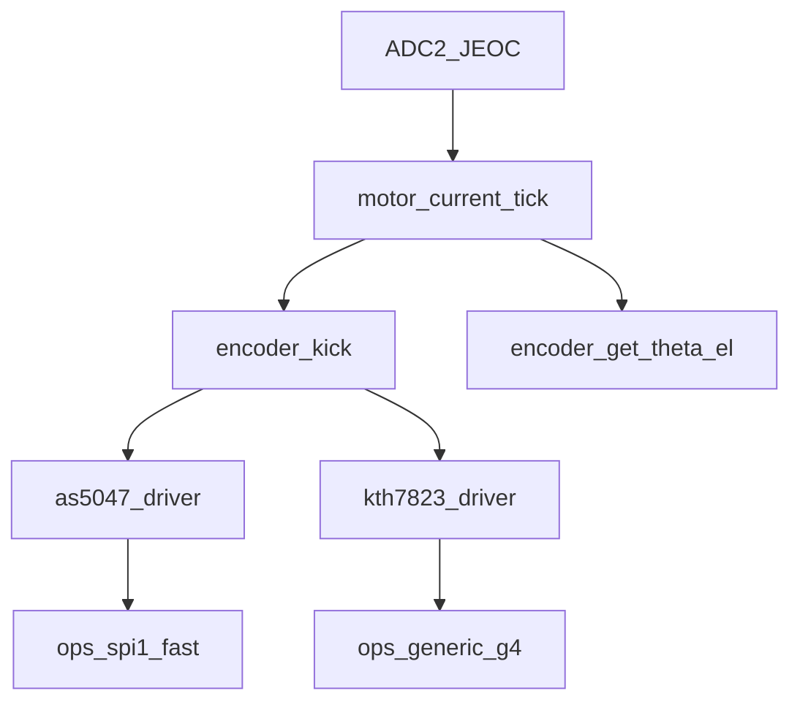
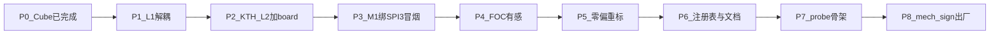

# 规划：KTH7823 编码器 SPI3 适配与出厂探索

> **日期：** 2026-10-08  
> **状态：** 台架有感 **已冻结**（见 [`报告_KTH7823编码器SPI3平台化适配_2026-10-09.md`](./报告_KTH7823编码器SPI3平台化适配_2026-10-09.md)）；P8/NVM 出厂工程化后置  

> **资料：** [`datasheet/KTH7823_datasheet.pdf`](../datasheet/KTH7823_datasheet.pdf)  
> **既有架构：** [`SPI编码器架构实现说明.md`](./SPI编码器架构实现说明.md)  
> **出厂零偏计划（背景）：** [`出厂校准与编码器零偏_实施计划_2026-06-09.md`](./出厂校准与编码器零偏_实施计划_2026-06-09.md)

---

## 0. 目标（三件事）

1. **用现有接口**（`encoder_t` / `encoder_driver_t` / `encoder_spi_bus`）在 **SPI3** 上适配 **KTH7823**。  
2. **沉淀适配菜谱**，使以后加第三颗芯片（如 MT6816）只加 `Drivers/<chip>/` + board 绑定。  
3. 在出厂 COMMISSIONING 里增加 **编码器探索**，至少能识别 **AS5047** 与 **KTH7823**（不挂 `open_seq` 电参数辨识）。  
4. 出厂必须标定/写入 **机械角方向**（`encoder_mech_sign`，±1）：安装朝向无法在软件里「猜对」，不能靠板型硬编码长期顶替。

默认约定（2026-10-08 台架）：**M1 角度源切 SPI3+KTH**；SPI1+AS5047 驱动保留可编译，宏可切回。

---

## 1. 现状锚点

| 层 | 路径 | 现状 |
|----|------|------|
| L1 | `Drivers/encoder/` | 薄 API；**`encoder_get_theta_el` 硬绑 AS5047 14bit** |
| L2 | `Drivers/as5047/` | 双帧 ANGLEUNC+NOP，DMA async |
| L3 | `platform/encoder_spi_bus_*` | SPI1 fast 已用；`generic_g4` 已预留 |
| L4 | `board/board_encoder_m1.c` | SPI1 + PA4 + DMA1 Ch2/3 |
| 控制 | `motor_current_tick` | 末尾 `encoder_kick` |
| SPI3 | Cube + GPIO | 引脚在，**无 DMA、无 board 实例**；`enc_m2` 仅占位 |
| 出厂 | `cal/factory_nvm` / `cal_step.h` | 有 `encoder_add` 字段但未真正 apply；`cal_step` 仅 shape |



---

## 2. CubeMX / SPI3：现在到底调好了没有？

**结论：引脚骨架有了，按 KTH7823 / 20 kHz DMA 编码器标准 —— 还没调好。**

对照 `.ioc` 与生成代码（`Core/Src/spi.c`、`dma.c`、`gpio.c`）：

| 项 | 现状 | 对 KTH7823 / 异步读角是否够用 |
|----|------|-------------------------------|
| SPI3 引脚 PB3/4/5 | 已配 AF6 Full Duplex Master | OK |
| 编码器 CS PA15（`SPI3_CS`） | GPIO 输出 | OK（软片选） |
| Flash CS PD2 | GPIO 输出 | OK；编码器时段必须保持高 |
| SPI3 数据宽度 | 16bit | OK（与现总线契约一致） |
| SPI3 模式 | **Mode1**（CPOL=0 + CPHA=2EDGE） | **不够**：KTH 要求 **Mode3**（CPOL=1, CPHA=1） |
| SPI3 DMA | **无**（DMA 只有 LPUART Ch1、SPI1 Ch2/3、USART1 Ch4/5） | **不够**：20 kHz 路径要 RX/TX 各一通道 |
| SPI3 波特 | Prescaler 8 → 约 **20 Mbit/s** | **超规格**：datasheet TSCK 最小 100 ns → SCK **≤10 MHz**；首轮建议 Prescaler ≥16（≤10 MHz），更稳可 32（5 MHz） |
| CS 复位初值 | Cube 把 SPI1_CS / SPI3_CS / Flash_CS 初值拉 **低** | 危险；依赖 `main` 再拉高。接 KTH 前须保证空闲 CS=H、Flash CS=H |
| `enc_m2` / board | 头文件占位，无 init、无 ISR | 软件侧未接 |

已占用 DMA1 通道：

```text
Ch1  LPUART1_TX
Ch2  SPI1_RX   ← M1 AS5047，勿动
Ch3  SPI1_TX
Ch4  USART1_TX
Ch5  USART1_RX
Ch6–Ch8  空闲 ← SPI3 优先用这里（建议 RX=Ch6、TX=Ch7）
```

**不是「Cube 完全没配」**，而是：**按旧计划给第二颗 AS5047（Mode1、可先阻塞）留了半成品；接 KTH7823 做 20 kHz 异步时，模式 / DMA / 空闲 CS 都还要补一刀。**

开工前建议在 CubeMX 先改（再 Generate，注意 USER CODE 区）：

1. SPI3：`CLKPolarity=HIGH`，`CLKPhase=2EDGE` → **Mode3**；波特 Prescaler ≥16（≤10 MHz，符合 TSCK≥100 ns）。  
2. DMA：SPI3_RX → DMA1_Ch6，SPI3_TX → DMA1_Ch7；Halfword；Normal；NVIC 开 RX TC，优先级对齐 SPI1 编码器档（低于电流环、高于遥测）。  
3. 确认 Generate 后 `HAL_SPI_MspInit(SPI3)` 挂上 DMA；ISR 里走 `board_encoder_spi3_dma_isr`，**不要**对编码器通道再调 `HAL_DMA_IRQHandler`（SPI1 踩过的坑）。

---

## 3. KTH7823 与 AS5047 关键差异

| 项 | AS5047（现行 SPI1） | KTH7823（目标 SPI3） |
|----|---------------------|----------------------|
| SPI 模式 | Mode1 | **Mode3** |
| raw | 14bit（`&0x3FFF`） | **16bit 全字** |
| 20 kHz 读角 | 双帧：命令 + NOP | **单帧**：MOSI=`0x0000`，一帧收回角度 |
| 寄存器 | 偶校验命令字 | opcode `01` 读 / `10` 写，双帧重叠；写 MTP ≥20 ms |
| θ 换算 | `2π/16384` | `2π/65536` |

总线契约（16bit `start_word`）可复用；差在 **L2 协议 + SPI 时序**。

---

## 4. 任务拆解

### 4.1 任务 1 — SPI3 适配 KTH（固件）

1. **L1 解耦（必先做）**  
   - `encoder_driver_t` 增加 `resolution_bits` 或 `raw_to_theta_el` 钩子。  
   - `encoder_get_theta_el` / `encoder_cal` 不再写死 / 强转 AS5047。

2. **L2 `Drivers/kth7823/`**  
   - `kth7823.h` / `kth7823_protocol.c` / `kth7823_async.c`  
   - async：**单帧** FSM；导出 `kth7823_encoder_driver`。

3. **L3/L4 + Cube**  
   - SPI3 Mode3 + DMA（见 §2）。  
   - `board/board_encoder_spi3.c`：`ops_generic_g4` + PA15 + DMA Ch6/7。  
   - bringup 宏选 M1 角度源：默认 SPI1+AS5047；`KTH7823_SPI3` 时绑 SPI3。

4. **验收**  
   - 先：手拧轴 → VOFA/raw 变化。  
   - 再：FOC 有感开环/闭环。  
   - Flash CS 全程释放。

### 4.2 任务 2 — 沉淀适配菜谱

实现阶段回写 [`SPI编码器架构实现说明.md`](./SPI编码器架构实现说明.md) §9，并另写短文 `方案_编码器芯片适配_KTH7823_*.md`。

纪律：

1. L2 只谈协议与指纹，导出 `xxx_encoder_driver`。  
2. L3 只谈 CS + 16bit DMA；SPI 模式由 board / probe 配。  
3. L4 只谈引脚实例。  
4. L1 禁止再写死芯片名。  
5. 控制与 cal 只认 `encoder_t*`。

建议常驻：

```c
typedef enum {
  ENC_CHIP_NONE = 0,
  ENC_CHIP_AS5047,
  ENC_CHIP_KTH7823,
} encoder_chip_id_t;

typedef struct {
  encoder_chip_id_t id;
  uint8_t spi_mode;          /* 1 or 3 */
  uint8_t resolution_bits;   /* 14 / 16 */
  uint8_t frames_per_sample; /* 2 / 1 */
  const encoder_driver_t *drv;
} encoder_chip_desc_t;
```

### 4.3 任务 3 — 出厂「编码器探索」

**挂载点：** COMMISSIONING / `cal_step`，**不要**挂 `ident_flow` / `open_seq`（电辨识依赖正确 θ）。

建议顺序：

```text
ADC_ZERO → ENCODER_PROBE（新）→ ENCODER_ZERO → ENCODER_MECH_DIR（新）→ PHASE → … → Rs/Ld
```

| 阶段 | 做法 |
|------|------|
| 短期 | `cal/encoder_probe.c` + 宏 `M1_RUN_ENCODER_PROBE` |
| 中期 | `cal_step.h` 增加 `CAL_STEP_ENCODER_PROBE`、`CAL_STEP_ENCODER_MECH_DIR` |
| NVM | `factory_nvm` version+1：字段 `encoder_chip`、`encoder_add`、**`encoder_mech_sign`（±1）**；补齐 write/apply |

指纹（无专用芯片 ID 时）：

- **AS5047 / Mode1**：读 DIAAGC/ANGLEUNC；偶校验 + AGC 合理 + 非全 0/全 1。  
- **KTH / Mode3**：读角 `0x0000` + 读寄存器 `0x00`/`0x09`（第二帧低 8 位为 0 的格式）；排除浮空。  
- 仲裁：期望总线优先，再交叉；双过报冲突；双不过 `ENC_CHIP_NONE` 停标定。

探测仅任务上下文阻塞；成功后再 DMA init，再锁转子零偏，再测机械角方向。

### 4.4 任务 4 — 出厂「机械角方向」`encoder_mech_sign`

**为什么必须进 NVM（不能长期靠宏）：**

- 编码器相对电机轴的安装朝向、磁环与芯片的相对旋转方向，**产线不可控**，软件事先写死会在换壳/换磁环后复现「速度环正反馈起飞」。  
- 台架已实测（`vofa+202610082301`）：KTH 路径下 **+Iq → enc_raw/ω 往负走**；临时用 `M1_ENCODER_MECH_SIGN=-1` 翻 **unwrap 机械角**（电角零偏不动）。这只是台架止血，**不是出厂方案**。  
- `M1_THETA_NEGATE` 只翻 Park 电角，**不要**拿来顶替机械方向；二者语义不同。

**建议判据（COMMISSIONING，低阻尼电机务必限流）：**

1. 已完成 `ENCODER_ZERO`（电角 `add` 有效）。  
2. 速度环短时阶跃（例如 +30…50 rpm），`|iq_ref|` 硬限很小（台架级 ≤1.5 A）。  
3. 观察一段时间：`sign(ω_fb)` 是否与 `sign(ω_ref)` 一致。  
   - 一致 → `mech_sign = +1`（相对当前 unwrap 约定）  
   - 相反 → `mech_sign = -1`，写入 NVM，后续 RUN 经 apply  
4. 失败门：ω 发散 / |iq| 顶满 / 超时 → 停 COMMISSIONING，不进 RUN。

**落点：**

| 项 | 说明 |
|----|------|
| 运行时 | 与现台架相同：`θ_mech = mech_sign * encoder_get_angle(...)`；电角仍 `raw_to_theta_el + add` |
| NVM | `factory_nvm` / `motor_cal_profile` 增加 `int8_t encoder_mech_sign`（仅允许 ±1） |
| 步骤 | `CAL_STEP_ENCODER_MECH_DIR`，挂在 `ENCODER_ZERO` 之后、PHASE 之前 |
| 台架过渡 | `bringup_bench.h` 的 `M1_ENCODER_MECH_SIGN` 可覆盖；产品默认读 NVM，缺省拒绝上速度环 |

---

## 5. 台架现实（2026-10-08 晚更新）

- CubeMX：**已完成** SPI3 Mode3 + 10 MHz + DMA Ch6/Ch7；CS 空闲 High。  
- 硬件：**KTH7823 已上架，替代原 AS5047**（SPI3 + PA15 CS）。  
- 软件（当晚后半）：M1 已绑 SPI3/KTH；锁转子得 `add≈2.038852`；**速度环曾因机械角反向正反馈起飞**，台架用 `M1_ENCODER_MECH_SIGN=-1` + 低速/限流止血。  
- **仍欠：** 出厂 NVM 的 `encoder_mech_sign` 自动判定步骤（§4.4 / P8）。

---

## 6. 逐步修改方案（按刀，可停可验）

### 总原则

1. 每刀结束：**Keil 0 Error / 0 Warning** + 可烧录包（`MDK-ARM/_pkg/<日期>_<名>/`）。  
2. 默认台架宏切到 KTH@SPI3；AS5047 驱动**保留可编译**，不删，方便以后换回。  
3. 热路径：LL DMA + 单帧 kick（学 AS5047，比它更简单）。  
4. 工厂/完整 cal_runner **本轮不做**；静态注册表最小集可以顺手落。



### P0 — Cube（已完成，验收用）

- [x] Mode3 / 10 MHz / Ch6 RX + Ch7 TX / CS High  
- [x] Ch6 ISR 改 LL（`board_encoder_spi3_dma_isr`）

### P1 — L1 解耦（小刀，不改硬件行为）

**目的：** 去掉「θ / 标定写死 AS5047」，AS5047 行为数值不变。

| 改什么 | 怎么改 |
|--------|--------|
| `encoder_driver_t` | 加 `raw_to_theta_el`、`blocking_read_angle`、`xfer_busy`（或等价） |
| `as5047_encoder_driver` | 填上上述钩子（现有公式搬家） |
| `encoder_get_theta_el` | 调 `e->drv->raw_to_theta_el` |
| `encoder_cal.c` | 去 `as5047_ctx_t*`；阻塞读 / 等 idle 走 driver |

**验收：** 仍绑 SPI1+AS5047 时编译过；若台上已无 AS5047，本刀可与 P2 合并烧一次，不必单独上台。

### P2 — KTH L2 + SPI3 board（核心新增）

| 新增/改 | 内容 |
|---------|------|
| `Drivers/kth7823/` | protocol（`0x0000` 读角、寄存器双帧）+ async **单帧** LL FSM |
| `board/board_encoder_spi3.c` | `ops_generic_g4`，SPI3，PA15，DMA Ch6/7 |
| `stm32g4xx_it.c` | Ch6 → `board_encoder_spi3_dma_isr()`，**去掉** `HAL_DMA_IRQHandler`（学 Ch2） |
| `irq_priority` | 补 Ch6（+可选 Ch7），`IRQ_PRIO_SPI3_DMA = 1` |
| Keil 工程 | 加源文件与 `Drivers/kth7823` include |

**验收（冒烟档）：** 可不进 FOC；上电后手拧轴，Watch/VOFA 看 `encoder_get_raw` 变化（0…65535）。

### P3 — M1 角度源切到 KTH@SPI3（台架默认）

| 改什么 | 怎么改 |
|--------|--------|
| `bringup_bench.h`（或 profile） | `M1_ENCODER_CHIP=KTH7823`，`M1_ENCODER_BUS=SPI3` |
| `bsp_init` / board | 按宏 init SPI3 实例；`axis->enc` 指向该实例（可仍叫逻辑「M1 角源」，不必启用 M2 轴） |
| `main` | offset：旧 `M1_ENCODER_OFFSET_RAD=2.10` **对 KTH 无效**；先用 0，P5 重标 |
| Flash CS | 保持 High；不碰 W25Q |

**验收：** 20 kHz kick 不 SKIP 爆炸；raw 连续、随手拧单调变化。

### P4 — FOC 有感最小闭环

- 开环 Uq 或现有有感电流环 profile（按你们常用冒烟档）。  
- Park/SVPWM 用 `encoder_get_theta_el`（16bit 路径）。  
- **验收：** 电流/力矩方向合理；θ 与转速相关；无乱跳。

### P5 — 零偏重标

- `M1_RUN_ENCODER_CAL=1` 跑锁转子（此时 cal 已走通用 blocking 读）。  
- 得到新 `add`，写入 bringup 宏或（若已接）NVM。  
- **验收：** Id 远小于 Iq（与旧 AS5047 标定同判据）。

### P6 — 注册表最小集 + 文档菜谱（可与 P4 并行文档）

- `encoder_chip_desc_t` 静态表：AS5047 + KTH7823。  
- `encoder_chip_lookup()`；board bind 经 id。  
- 回写 `SPI编码器架构实现说明.md` §9；短文「适配菜谱」。  
- **不做**运行时工厂。

### P7 — 出厂探索骨架（可后置）

- `encoder_probe` + `CAL_STEP_ENCODER_PROBE` + NVM `encoder_chip` 字段。  
- 台上已确定是 KTH 时，探索非阻塞路径；为「以后混装板」留钩子即可。

### P8 — 出厂机械角方向（必做，可后于混装探测）

- NVM：`encoder_mech_sign`（±1）write/apply；与 `encoder_add` 同 profile。  
- `CAL_STEP_ENCODER_MECH_DIR`：低速限流速度阶跃，按 `sign(ω_fb)` vs `sign(ω_ref)` 自动写 sign。  
- 产品路径：**未写入有效 mech_sign 时禁止上速度/位置外环**（仅允许锁转子 / 开环诊断）。  
- 台架宏 `M1_ENCODER_MECH_SIGN` 降级为调试覆盖；签收后以 NVM 为准。  
- **验收：** 换磁环朝向或故意装反后，COMMISSIONING 能改写 sign，上电速度环不再正反馈起飞。

---

## 7. 每刀风险与回滚

| 刀 | 主要风险 | 回滚 |
|----|----------|------|
| P1 | 钩子漏填导致 θ=0 | 恢复 `as5047_raw_to_theta_el` 直调 |
| P2/P3 | ISR 仍走 HAL → DMA 卡死 | Ch6 只留 board ISR |
| P3 | 仍读 SPI1 | 查 `axis->enc` / init 是否切到 spi3 |
| P4 | 旧 add=2.10 电角错 | offset 先清 0，再 P5 |
| P4 | Mode/波特错 | 复测 Cube：Mode3、≤10 MHz |
| P8 | 限流过大仍飞 / 误判 sign | 阶跃 rpm↓、`|iq|`↓；失败则停 COMMISSIONING |

---

## 8. 风险与卫生（总）

- Mode 配错会整路哑火。  
- 旧 `encoder_add≈2.10` 是 AS5047 台架值，**不能**直接用于 KTH。  
- **编码器方向与芯片型号正交**：安装朝向反了时，必须 **raw 级反向**（`M1_ENCODER_DIR_REV` / `kth7823_raw_dir`），同时作用于 unwrap **与** 电角；只翻 `MECH_SIGN` 会让速度环与 Park 换向不一致 → `iq` 顶满却几乎不转（见 `vofa+202610082325`）。  
- SPI3 与 W25Q 争用：编码器时段 Flash CS 保持高。  
- `datasheet/_kth7823_extract.txt`：实现前按仓库卫生删除，勿提交。

---

## 9. 明确不在本轮（台架止血之后）

- 双轴同时 FOC。  
- SPI3 上跑 Flash OTA。  
- 完整 cal_runner / E6 CALIB（含 P8 自动化，可单开刀）。  
- 改 Rs/Ld `open_seq`。  
- 删除 AS5047 源码（保留，宏切回）。  
- 用 `M1_THETA_NEGATE` 冒充机械方向。
